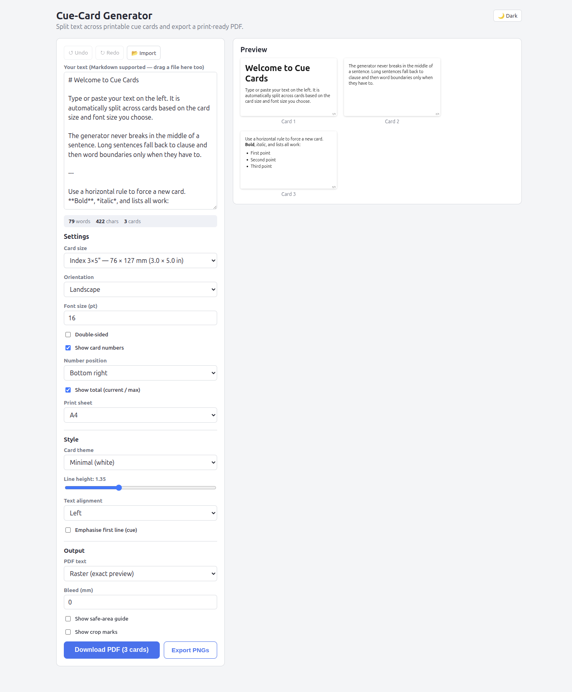
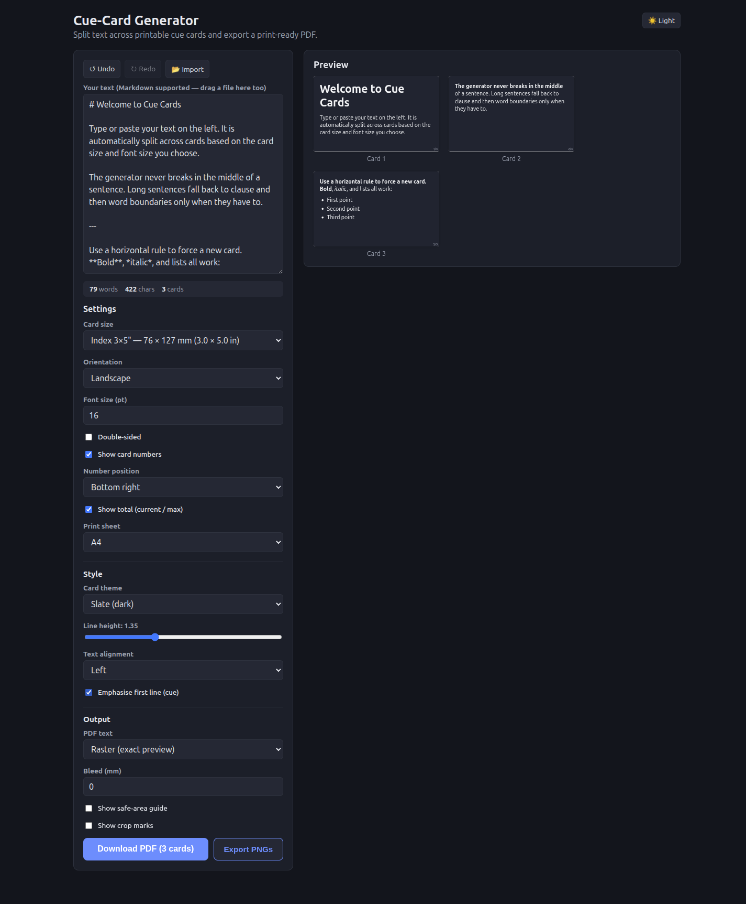
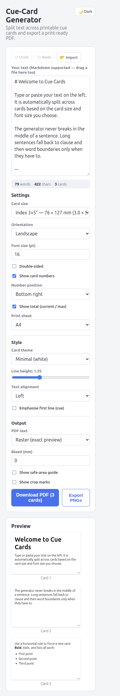

<div align="center">

# 🃏 Cue-Card Generator

**Turn any text into beautiful, print-ready cue cards — right in your browser.**

Paste your script, pick a card size, and download a ready-to-print PDF. The text is
split intelligently across cards so it _never_ breaks in the middle of a sentence.

[](https://vite.dev)
[](https://react.dev)
[](https://www.typescriptlang.org)
[](https://pages.github.com)



</div>

---

## ✨ Features

| | |
|---|---|
| 📝 **Markdown input** | Headings, **bold**, _italic_, lists, and code render on the cards. |
| ✂️ **Sentence-safe splitting** | Breaks at sentence boundaries first, then clauses (`,` `;`), then words only as a last resort. |
| ⏭️ **Manual breaks** | Drop a horizontal rule (`---`) anywhere to force a new card. |
| 📐 **Flexible sizes** | A7, A6, Index 3×5 / 4×6 / 5×8, or custom — shown in **metric & imperial**. |
| 🔄 **Single or double-sided** | Continue text onto the back, or add a blank **notes** back. |
| 🖨️ **Duplex-aware** | Choose long- or short-edge flip so the backs line up when printing. |
| 🔢 **Card numbers** | Optional, position anywhere, as `current` or `current / max`. |
| 🎨 **Card themes** | Minimal, Bordered, Paper, Slate, Highlighter — default is clean white. |
| 🌙 **Dark mode** | A comfortable dark UI for the editor (independent of the card theme). |
| 🔠 **Typography controls** | Adjustable line height, text alignment, and a first-line **cue emphasis**. |
| 📄 **PDF export** | **Raster** (pixel-perfect) or **Vector** (selectable text), multiple cards per A4 / US Letter sheet. |
| 🖼️ **PNG export** | Download every card as a PNG, bundled in a zip. |
| ✁ **Print guides** | Cut lines, optional crop marks, safe-area guide, and bleed. |
| 📂 **Import & paste** | Load a `.txt` / `.md` file via the button or drag-and-drop. |
| ↩️ **Undo / redo** | Full history with `Ctrl+Z` / `Ctrl+Shift+Z`. |
| 📊 **Live stats** | Word / character counts, card totals, and overflow warnings. |
| 👀 **Live preview** | See every card update as you type. |
| ♿ **Accessible** | Keyboard friendly, focus styles, ARIA labels, reduced-motion support. |
| ☁️ **100% client-side** | No server, no upload — runs entirely in the browser. |

## 🚀 Quick start

```bash
npm install
npm run dev
```

Then open the local URL Vite prints (e.g. `http://localhost:5173/Cue-Cards/`).

### How to use

1. Paste, type, or **drag in** a `.txt` / `.md` file (Markdown welcome).
2. Pick a **card size**, **orientation**, and **font size**.
3. Style it: choose a **card theme**, **line height**, **alignment**, and optional **cue emphasis**.
4. Toggle **double-sided** (continue text or notes back) and **card numbers** to taste.
5. Choose **Raster** or **Vector** PDF and add **crop marks / bleed** if your print shop needs them.
6. Watch the **live preview**, then **Download PDF** or **Export PNGs**.
7. Print on card stock (or paper) and cut along the guide lines. ✂️

> 💡 **Tip:** Insert a line containing only `---` to force the next chunk onto a new card.

## 🎨 Themes & dark mode

Five card themes ship out of the box — the default is a clean, borderless white card.
The editor also has its own dark mode, independent of the card theme you print.

<div align="center">
  
</div>

## 📱 Responsive

The layout collapses to a single column on small screens.

<div align="center">
  
</div>

## 🛠️ Scripts

| Command | Description |
|---|---|
| `npm run dev` | Start the dev server with hot reload. |
| `npm run build` | Type-check and build to `dist/`. |
| `npm run preview` | Preview the production build locally. |

## 🌐 Deployment

Every push to `main` builds the site and publishes it to **GitHub Pages** via
[`.github/workflows/deploy.yml`](.github/workflows/deploy.yml). Enable Pages in your
repository settings with **Source: GitHub Actions**.

The Vite `base` is set to `/Cue-Cards/` in [`vite.config.ts`](vite.config.ts) — update
it if you rename the repository.

## 🧱 Tech stack

- **Vite + React + TypeScript** for the app shell.
- **react-markdown** + **remark-gfm** for Markdown rendering.
- **html2canvas-pro** + **jsPDF** for client-side raster PDF and PNG export.
- **marked** drives the vector PDF renderer (selectable text).
- **JSZip** bundles the PNG export.
- Smart packing driven by real DOM measurement, so the preview matches the PDF.

## 📂 Project structure

```
src/
├── components/        # Card, CardPreview, SettingsPanel, StatsBar
├── hooks/
│   └── useHistory.ts  # undo / redo with edit coalescing
├── lib/
│   ├── splitter.ts    # text → cards (sentence/clause/word logic)
│   ├── measure.ts     # off-screen height measurement
│   ├── pdfLayout.ts   # sheet grid, cut lines, crop marks, bleed, duplex
│   ├── pdf.ts         # raster PDF (html2canvas → jsPDF)
│   ├── pdfVector.ts   # vector PDF with selectable text
│   ├── exportImages.ts# PNG zip export
│   ├── cardThemes.ts  # card colour themes
│   ├── cardStyle.ts   # padding / font / line-height helpers
│   └── cardSizes.ts   # size presets + unit helpers
└── App.tsx            # state + wiring
```

---

<div align="center">
Made for anyone who speaks from cards — presenters, students, performers, and speakers. 🎤
</div>
